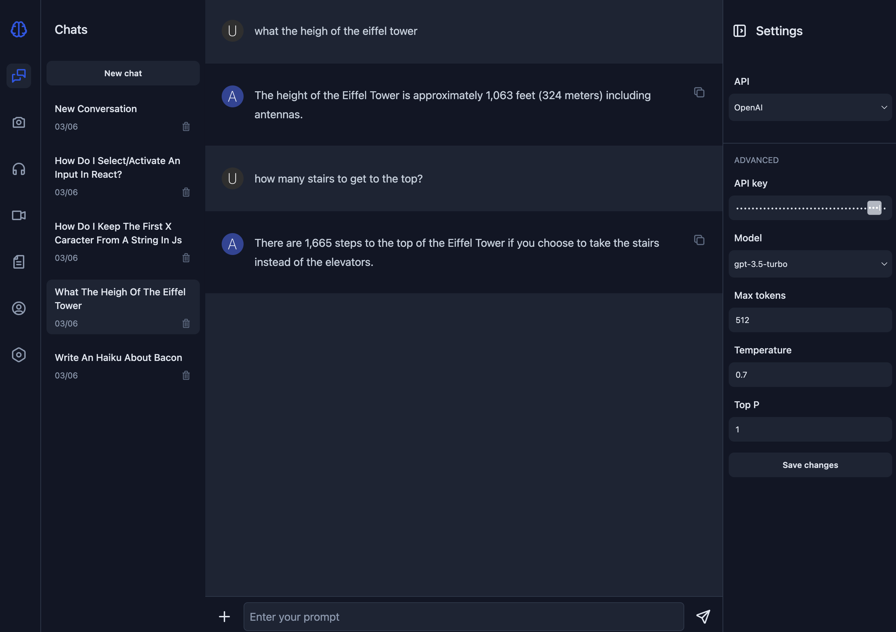

<!-- PROJECT LOGO -->
<br />
<div align="center">
  <a href="https://github.com/fertilisai/sapio-react">
    
  </a>

  <h2 align="center">Sapio</h2>

  <p align="center">
    A smarter way to use LLMs
  </p>
</div>

<!-- ABOUT THE PROJECT -->

## About The Project



Sapio is a Generative AI Studio that allows you to use LLMs with privacy in mind. The goal is to continue adding features frequently and make the LLMs capabilities event more powerful.

Why not just using ChatGPT instead?

- Privacy first (no logs, chats not used by OpenAI for training)
- Conversations are stored locally in the browser
- Always available (no busy servers)
- No login and connection timeout
- More parameters to play with
- A fraction of the cost of ChatGPT Pro

<!-- INSTALLATION -->

## Installation

1. Get an API key at [https://platform.openai.com/](https://platform.openai.com/)
2. Clone the repo
   ```sh
   git clone https://github.com/fertilisai/sapio-react.git
   ```
3. Install dependencies
   ```sh
   npm install
   ```
4. Run node
   ```sh
   npm run dev
   ```
5. Enter your API key in the settings menu
6. Start to chat

<!-- FEATURES -->

## Features

- Settings (system prompt, model, temperature, max_tokens, top_p)
- Chat history
- Copy to clipboard
- Dark mode

<!-- ROADMAP -->

## Roadmap

- [x] Markdown support & syntax highlighting
- [x] Drag and drop Conversations & Sections
- [x] OpenRouter
- [x] TTS (Text to Speech) & STT (Speech to Text)
- [x] Stream responses
- [ ] Local LLMs (Llama, Mistral, etc.)
- [ ] Adding modalities (image, audio, video)

<!-- ACKNOWLEDGEMENT -->

## Acknowledgement

- [OpenAI](https://openai.com/)
- [Langui.dev](https://www.langui.dev/)
- [Marked.js](https://marked.js.org/)
- [DOMPurify](https://github.com/cure53/DOMPurify)
- [Highlight.js](https://highlightjs.org/)

<!-- LICENSE -->

## License

Distributed under the MIT License. See `LICENSE` for more information.
